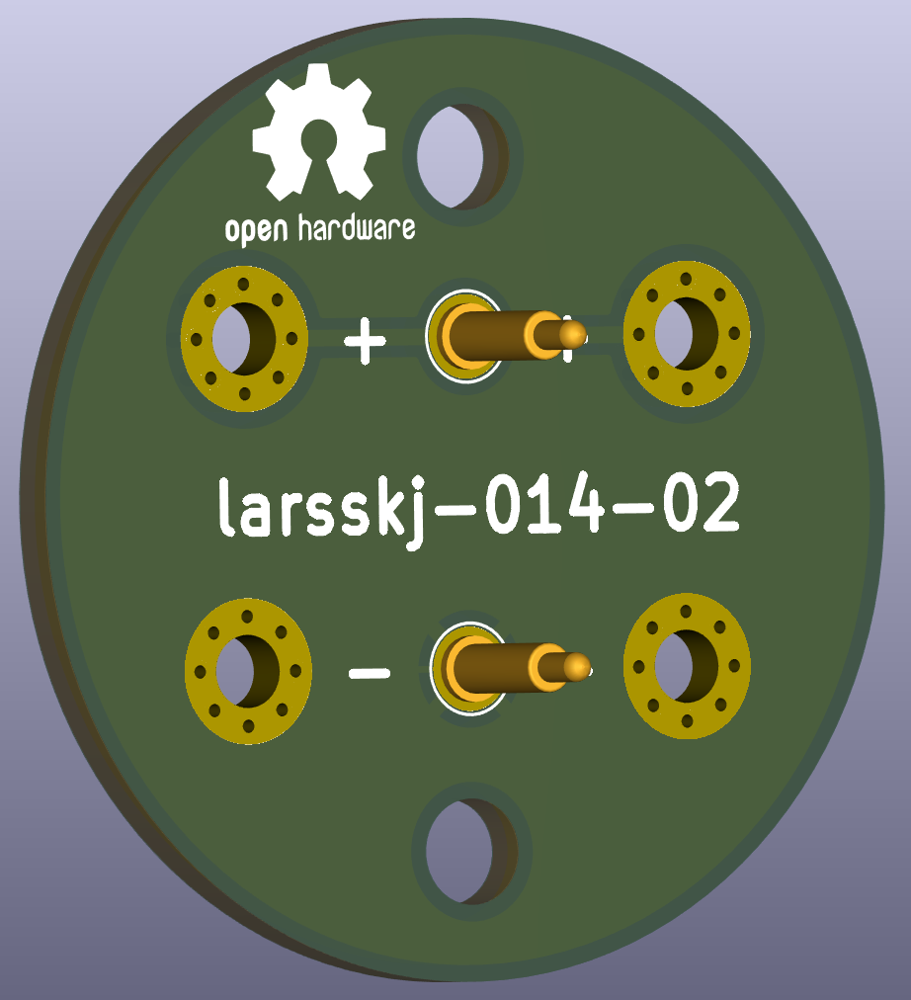

A board hosting pogo pins
=========================

### larsskj-014

This project is a board hosting a couple of pogo pins intended to supply power to structures and other scale models.

The board has a diameter of 29 mm intended to be mounted in a 30 mm hole. The distance between the pogo pins is 10 mm.

For more information, visit the [project homepage](https://larsskj.org/projects/larsskj-014).

